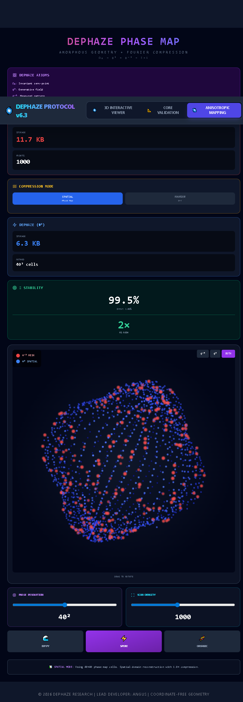
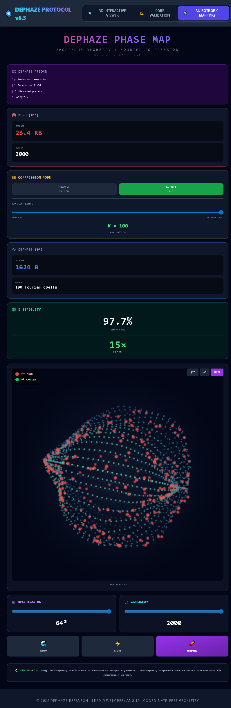

# Dephaze-Topologies
Dephaze-Topologies demonstrates a complexity-invariant, implicit geometry representation
where storage size does not scale with geometric detail.

### The obsolescence of polygons. The emergence of implicit topology.

[](https://dephaze-topologies.vercel.app/)
[](https://doi.org/10.5281/zenodo.18254425)

**DEPHAZE is a geometry representation that is not stored as triangles.**
Geometry is resolved locally as a phase-stabilized generative field
around an invariant zero-point reference (Ω₀).

---

## What this is
- A **working prototype** demonstrating:
  1) **Primitive implicit topologies** generated from a minimal generative seed.
  2) **Abstract / scanned topologies** represented as a phase field and reconstructed
     with optional Fourier Top-K transport.

## What this is NOT
- Not mesh compression.
- Not a new STL format.
- Not a scanner that invents detail.
- Not claiming infinite physical resolution — hardware limits always apply.
- The focus is **complexity-invariant representation**, not triangle count.

---

## Demonstration

### Near-lossless spatial reconstruction


### Fourier transport compression


---

# Part I — Primitive Topologies (Core Kernel)

## Universal Master Formula  
### Lamé-Corrected Generative Field

Every convex primitive — from spheres to cubes and continuous hybrids —
is generated by a **phase-stabilized field**, not by a fixed implicit surface.

A Lamé-style exponent appears only as a **local curvature correction**
inside the Dephaze generative formulation:

\[
\Xi(x, y, z) =
\frac{R}{\left(|x|^n + |y|^n + |z|^n\right)^{1/n}},
\quad
\Xi = 1 \Rightarrow \text{stable boundary condition}
\]

- n = 2 → spherical curvature
- n = 1 → octahedral tendency
- n → ∞ → cubic limit (Chebyshev-like)

**Important:**  
This formulation does **not** define a metric space or a global Lamé surface.
Lamé exponents act only as a **partial curvature model**, corrected and stabilized
by the Dephaze phase dynamics around Ω₀.

**Storage:** ~16 bytes (R, n as two scalars in the demo).  
**Rendering:** the surface is resolved on-demand from the generative field.

---

# Part II — Abstract Topologies  
## Scan → Phase Map → Reconstruction

Real objects are not closed-form primitives.
This prototype therefore demonstrates a second pipeline.

### 1) Scan (φ⁻³)
Geometry is sampled (synthetic in the demo) as directional measurements,
representing the **measured residual pattern**.

### 2) Phase Map (Spatial Domain)
Instead of storing XYZ point clouds, measurements are projected into a compact
**phase field**:

- phase coordinates: (θ, φ) direction bins
- stored value: a scalar describing generative deviation along each direction

In the current demo, a **Lamé-derived corrective term** is applied
inside the phase mapping to improve stability:
- correction depends only on direction (no circular dependency)
- reconstruction removes the correction implicitly

### 3) Reconstruction (φ³)
The object is reconstructed from the phase field:
- **Spatial mode:** direct phase lookup (near-lossless)
- **Fourier mode:** Top-K frequency transport (extreme compression)

---

## Accuracy metric (demo-defined)
The UI reports **Ξ Stability %**, a relative metric derived from
average reconstruction deviation across directions.

It is intended for **mode-to-mode comparison**, not absolute metrology.

Typical observed values:
- **Spatial phase map:** ~99–99.9%
- **Fourier Top-K:** ~96–98% depending on K and resolution

---

## Storage scaling (key result)

### Legacy geometry
- Storage scales with sample count and detail.
- High-fidelity assets grow into MB → GB → TB pipelines.

### Dephaze representation
- **Spatial:** scales with phase resolution (N²), not scan density.
- **Fourier:** scales with Top-K coefficient count (≈ constant).

Example from the demo:
- Mesh (2000 points): ~23.4 KB
- Dephaze Fourier (K=100): ~1624 B

This demonstrates **complexity-invariant transport and storage**
with controllable accuracy.

---

# Live Demo
https://dephaze-topologies.vercel.app/

- 3D Interactive Viewer
- Core Validation (primitive equivalences)
- Anisotropic Mapping (abstract scan → phase → Fourier)

---

# Implementation notes
This repository is a prototype (JS/React).
The Dephaze kernel is designed to be portable to:

- C / C++
- GPU shaders (GLSL / HLSL)
- Python
- Rust

Core kernel (illustrative):

```python
def dephaze_kernel(x, y, z, R, n):
    pattern = (abs(x)**n + abs(y)**n + abs(z)**n)**(1/n)
    return R / pattern
